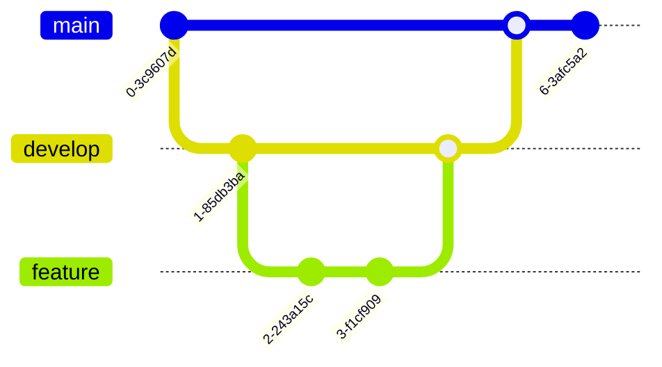

# Modern Blog Website

A modern, responsive blog website with advanced UI/UX features, 3D effects, and dynamic content loading. Built with HTML, CSS, and JavaScript.

## Project Architecture


## Features

### Visual Effects & Animations
- 3D card flipping effects with smooth transitions
- Parallax scrolling in hero section
- Glass morphism effects in navigation
- Advanced button animations with 3D transforms
- Floating animations for text elements
- Gradient text with glow effects
- Custom scrollbar with gradient design
- Loading animations and spinners
- Ripple effects on interactive elements
- Shine effects on hover states


### Layout & Design
- Responsive masonry grid layout
- Modern card designs with hover effects
- Advanced typography with Google Fonts (Inter & Poppins)
- Dark/Light theme toggle
- Glass morphism navigation
- Gradient borders and shadows
- Custom scrollbar styling

### User Experience Flow


### Performance
- Lazy loading images
- Optimized animations
- Efficient CSS variables
- Smooth transitions
- Mobile-first approach

## Getting Started

1. Clone the repository:
```bash
git clone https://github.com/PLP-WebTechnologies/Saf-Hook-Capstone-Web.git
```

2. Open `index.html` in your browser to view the website.

## Project Structure


## CSS Variables

The project uses CSS variables for consistent styling. Key variables include:

```css
:root {
    --primary-color: #4f46e5;
    --secondary-color: #818cf8;
    --accent-color: #8b5cf6;
    /* ... other variables */
}
```

## JavaScript Features


## Browser Support

- Chrome (latest)
- Firefox (latest)
- Safari (latest)
- Edge (latest)

## Contributing

1. Fork the repository
2. Create your feature branch (`git checkout -b feature/AmazingFeature`)
3. Commit your changes (`git commit -m 'Add some AmazingFeature'`)
4. Push to the branch (`git push origin feature/AmazingFeature`)
5. Open a Pull Request

## Development Workflow



## License

This project is licensed under the MIT License - see the LICENSE file for details.

## Acknowledgments

- Images from [Unsplash](https://unsplash.com)
- Icons from [Font Awesome](https://fontawesome.com)
- Fonts from [Google Fonts](https://fonts.google.com) 